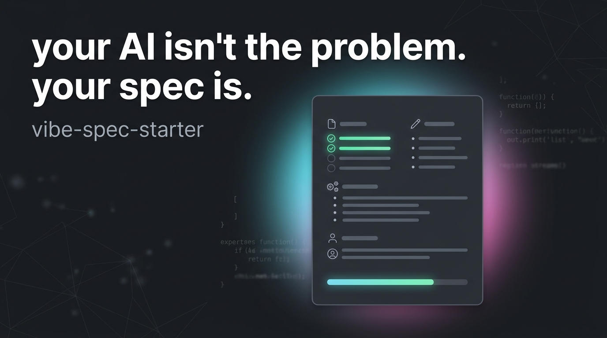

# vibe-spec-starter



your AI isn't the problem. your spec is.

most beginners are not actually using weak models.
they're giving decent models vague instructions, then wondering why the build drifts, skips constraints, or invents random shit halfway through.

`vibe-spec-starter` is a practical starter repo for writing AI-readable specs before you start coding, so Claude Code, Codex, Cursor, Gemini, and similar tools have something real to follow.

## what this solves

if your AI keeps:
- building the wrong thing
- skipping constraints you thought were obvious
- making up details you never asked for
- forgetting what matters halfway through the task
- shipping something that looks complete but fails basic expectations

that is usually a spec problem, not just a model problem.

## the idea in one minute

bad prompt:
> build me a small app for tracking links

better spec:
> build a url shortener for solo builders with email login, sqlite, a dashboard with link list + click counts, no teams, no payments, and a hard rule that every mutation must be server-validated.

same model. same tool. much better odds of getting something usable.

## what's in here

| file | what it does |
|------|--------------|
| `SPEC.md` | the main fill-in-the-blanks spec template |
| `SPEC_EXAMPLE.md` | a real filled example so you can see what "good" looks like |
| `CLAUDE.md` | tells Claude Code to read the spec before coding |
| `.claude/projects/SPEC.md` | Claude-friendly location for the same core spec |
| `TESTING_CHECKLIST.md` | quick verification list for "did the AI actually build what I asked for?" |
| `context_rules.md` | what belongs in the spec vs what should stay out |
| `AGENTS.md` | repo rules so AI tools behave predictably in this project |
| `SECURITY.md` | pre-flight security checklist for AI-generated code |
| `docs/spec-teardown.md` | explains why each spec section exists |
| `examples/` | extra example specs you can steal and adapt |

## quick start

### option A, use it in your own repo
1. copy `SPEC.md` into your repo root
2. fill it out before you start prompting
3. add `CLAUDE.md` or adapt `AGENTS.md` so your AI reads the spec first
4. build from the spec instead of re-explaining yourself every session
5. check the result against `TESTING_CHECKLIST.md`

### option B, learn from the examples
1. read `SPEC_EXAMPLE.md`
2. open `docs/spec-teardown.md`
3. compare it with `examples/incomplete-spec-example.md`
4. steal the structure, not the exact app idea

## before / after

### before
"build me a small app for tracking links"

### after
"build a url shortener for solo builders with email login, sqlite, a dashboard with click counts, no teams, no payments, server-side validation on every mutation, and hard rejection of non-http/https urls."

same model.
same tool.
way less room for the AI to freestyle in the wrong direction.

## who this is for

- beginner vibe coders
- solo builders using AI tools daily
- people tired of drift, vague output, and repeated corrections
- anyone who knows they need "more context" but does not know what good context looks like

## what makes a good spec

a good spec is:
- specific enough to remove ambiguity
- short enough that the AI can actually hold onto it
- clear about constraints, permissions, invariants, and done state
- honest about what is still undecided
- explicit about what the AI should default to vs what it must ask about

it is not:
- a motivational essay
- a brainstorm dump
- a pile of half-committed ideas
- a place to hide secrets

## repo structure

```text
vibe-spec-starter/
├── .claude/
│   └── projects/
│       └── SPEC.md
├── AGENTS.md
├── CLAUDE.md
├── SECURITY.md
├── SPEC.md
├── SPEC_EXAMPLE.md
├── TESTING_CHECKLIST.md
├── context_rules.md
├── docs/
│   ├── reviewer-rubric.md
│   └── spec-teardown.md
├── examples/
│   ├── bug-board-spec.md
│   ├── habit-tracker-spec.md
│   └── incomplete-spec-example.md
└── src/
    └── placeholder/
```

## how to know if your spec is good enough

use `docs/reviewer-rubric.md` before you build.

if your spec is missing permissions, defaults, or blocking questions, fix the spec first.
that is almost always faster than cleaning up a wrong build later.

## roadmap

### free
- one strong spec template
- one strong example spec
- extra example specs for different tiny app types
- AI instructions for spec-first building
- testing checklist
- spec teardown doc
- guidance for defaults, invariants, and blocking questions

### later premium path
- more example specs for different app types
- spec-review workflow / skill
- deeper walkthroughs and teardown videos
- premium examples for more serious product shapes

## how to use this with AI tools

### Claude Code
- keep `SPEC.md` in the repo
- use `CLAUDE.md` so Claude reads it first

### Codex / Cursor / Gemini
- keep `SPEC.md` in the repo root
- adapt the guidance from `AGENTS.md`
- make the spec the source of truth before code generation starts

## the actual bet

this repo is built around one belief:

> beginners do not just need better prompts.
> they need a better way to think before prompting.

and more specifically:

> the best spec is not the longest one.
> it's the one that removes the dangerous guesses.

that’s the whole play.

---

MIT. do whatever you want with these.

made by @BChopLXXXII

built for vibe coders who just want their AI to feel less... corporate.

ship it. 🚀

if this helped, ⭐ the repo — it helps others find it.
